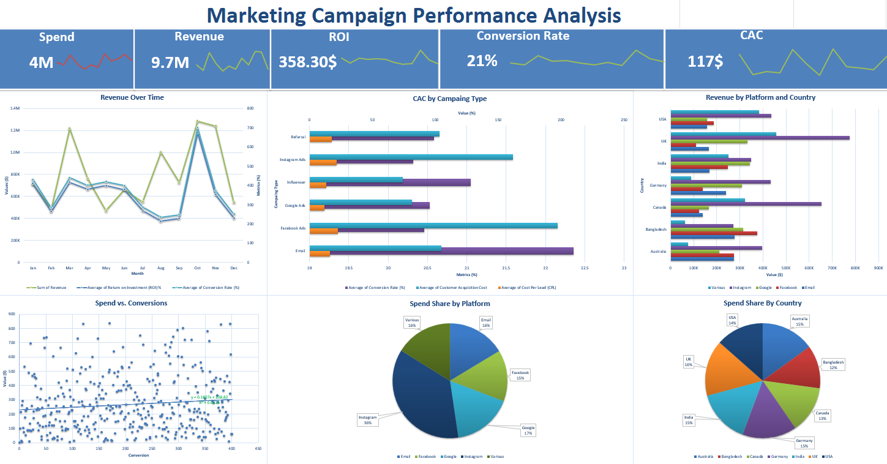

# Marketing Campaign Performance Analysis
This project analyzes `real-world marketing campaigns` to evaluate return on investment, `cost-efficiency`, `audience targeting`, and `platform performance`. Builting Excel dashboards. it is designed to answer key marketing strategy questions for a retail e-commerce company operating across multiple channels and regions.

## Business Objective
The leadership team wants to optimize marketing spend by understanding which `campaigns`, `platforms`, `countries`, and `customer segments` bring the most value — measured in `terms of conversions`, `revenue`, `ROI`, and `cost per acquisition`.

## Business Questions

**1.** Which campaign types deliver the highest ROI and lowest CAC?	
**2.** Are some platforms underperforming despite high spend?	
**3.** Which countries are giving best returns on investment?	
**4.** What are the most profitable age and gender segments?	
**5.** Are longer campaigns more effective than short ones?	
**6.** Are there seasonal patterns in ROI or revenue?	
**7.** Does higher spend correlate with more conversions?	
**8.** Who are the top-performing campaigns overall?	
**9.** What share of budget goes to which platform or country?	
**10.** Which campaigns are under- or over-performing against the average?	

## KPIs & Metrics
| Metric                  | Formula                          | Why It Matters                                 |
| ----------------------- | --------------------------------- | ---------------------------------------------- |
| `Conversion Rate (%)` | `(Conversions / Leads) × 100`       | `Measures effectiveness of lead conversion`      |
| `CPL `                | `Spend / Leads`                     | `Shows how much it costs to generate a lead`     |
| `CAC`                 | `Spend / Customers`                 | `How much it costs to acquire a paying customer` |
| `ROI (%) `            | `((Revenue - Spend) / Spend) × 100` | `Core profitability metric`                      |
| `Revenue/Customer`   | `Revenue / Customers`               | `How valuable is each customer`                  |
| `Campaign Profit`     | `Revenue - Spend`                   | `Net impact of each campaign`                    |

## 🧠 Key Insights

- `📈 Google Ads has the best ROI and lowest CPL, making it the most efficient channel.`

- `🧑‍🤝‍🧑 25–34 age group outperforms others in conversion rate across all genders.`

- `📉 Campaigns longer than 20 days show diminishing ROI — the sweet spot is 15–20 days.`

- `🌍 USA & Bangladesh drive the highest ROI; Australia shows high CPL and poor efficiency.`

- `💸 Facebook has high spend but comparatively lower ROI than Instagram or Google.`

- `📬 Email campaigns have the highest conversion rate (~22%), ideal for retention-focused strategies.`

- `📊 Referral campaigns generate high revenue but show inconsistent ROI — may require better partner control.`

- `⏳ Short campaigns (<10 days) underperform across all KPIs — not worth the budget.`

- `📌 March & June show consistently low ROI and conversion — reduce campaign volume in these months.`

- `🎯 Spend beyond $12–14K per campaign yields diminishing returns — optimize budget caps accordingly.`

- `🌐 Canada shows exceptional ROI with moderate spend — a potential growth market.`

## Tools Used

- **Excel:** KPI calculations, PivotTables, dynamic slicers, conditional formatting, dashboard layout

## Dataset Description

| Field                         | Type        | Description                       |
| ----------------------------- | ----------- | --------------------------------- |
| `Campaign\_ID`                  | `Categorical` | `Unique campaign identifier`        |
| `Start\_Date / End\_Date`       | `Date`        | `Time duration of campaign`         |
| `Country, Currency`             | `Categorical` | `Location details`                  |
| `Age\_Group, Gender`            | `Categorical` | `Demographic segmentation`          |
| `Campaign\_Type`                | `Categorical` | `Email, Social, Google Ads, etc.`   |
| `Platform`                      | `Categorical` | `Google, Instagram, Facebook, etc.` |
| `Spend, Revenue`                | `Numeric`     | `Financial performance`             |
| `Leads, Conversions, Customers` | `Numeric`     | `Conversion funnel values`          |

## Dashboard Preview

## Recommendations

- `Focus future spend on Google Ads and Instagram Ads`

- `Target ages 25–34 in high-performing regions like USA, Bangladesh`

- `Avoid campaign durations beyond 20 days`

- `Investigate why Australia and 45–54 age group underperform`

- `Reallocate budget away from platforms with high CPL but low ROI`
